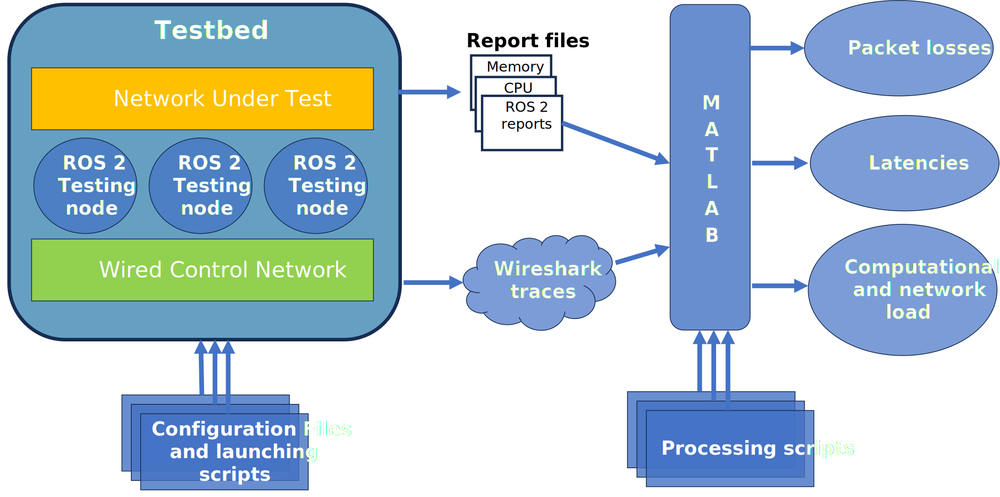

# ROS 2 swarm: An experimental study repository

### Testbed and methodology for evaluating ROS 2 wireless communications

This software aims to provide a reliable, reproducible and easy-to-use testbed and methodology for evaluating the feasibility of executing and communicating ROS 2 robot swarms. 

Related work:

1. Castillo-Sánchez J.B, González-Parada E., Cano-García J.M: *[A Novel Testbed for Evaluating ROS 2 Robot Swarm Wireless Communications](https://ieeexplore.ieee.org/document/10608676)* - 2024
2. Castillo-Sánchez J.B, González-Parada E., Cano-García J.M: *[Swarm Robots in ROS 2: An Experimental Study](https://ieeexplore.ieee.org/document/10699316)* - 2024

**The structure of the repository is as follows:**
```
TestbedROS2Swarm
├── dds_ros2
│   ├── scripts
│   ├── src
├── analysis_scripts
│   ├── auxiliary
│   ├── MATLAB
├── LICENSE
```

Note: Compiled against and tested on ROS 2 Humble Hawksbill distribution under Ubuntu Linux 22.04 LTS (x86 and aarch64).



## Credits

This software was actively developed and contributed by:
 - José Manuel Cano García
 - José Borja Castillo Sánchez
 - Eva González Parada

All members are affiliated at [University of Malaga](https://www.uma.es/), department of Electronic Techonology and [Malaga Telecommunications Research Institute](https://www.telma.uma.es/).


## Copyright and License

This software is distributed under the terms of the GNU General Public License as published by the Free Software Foundation, either version 3 of the License, or (at your option) any later version.

This package is at Copyright (c) University of Malaga. This copyright information is specified in the headers of the corresponding files.

## Acknowledgements

This work has been supported by project TED2021-
130456B-I00, funded by MCIN/AEI/10.13039/501100011033
and EU ”NextGenerationEU/PRTR” program and the Malaga
University project B4-2023-12.
